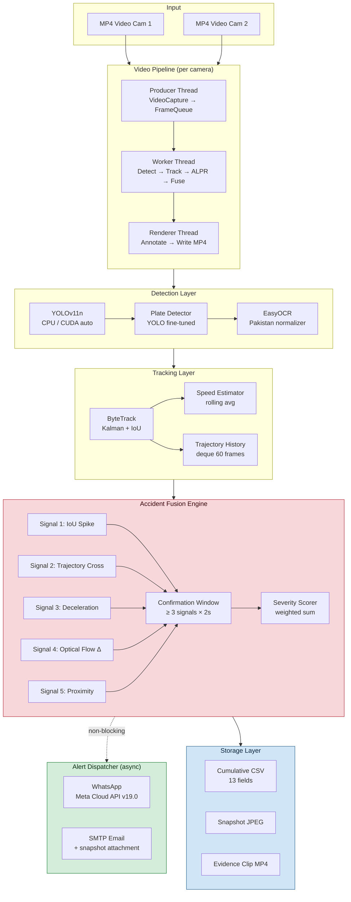

# AI-Powered Intelligent Traffic Surveillance System

Academic Research Prototype · NED University Final Year Project

[](https://github.com/Saifee16/ms-ada-traffic-accident-detection/actions/workflows/ci.yml)
[](LICENSE)
[](https://www.python.org/downloads/release/python-3120/)

Real-time vehicle detection, tracking, ALPR, accident detection, hit-and-run monitoring, evidence capture, CSV output, and WhatsApp/SMTP alerting for recorded MP4 traffic videos.

## Windows Setup

```powershell
python --version  # tested with Python 3.12.5
python -m venv .venv
.\.venv\Scripts\Activate.ps1
pip install torch==2.4.1+cpu torchvision==0.19.1+cpu --extra-index-url https://download.pytorch.org/whl/cpu
pip install -r requirements.txt
```

The default config uses `system.device: auto`, so the app runs on CPU now and can use CUDA later when a compatible GPU/PyTorch build is installed.

## How It Works

MS-ADA combines YOLOv11n vehicle detection, ByteTrack-style identity persistence, per-track motion history, ALPR, and a deterministic accident fusion module. The fusion logic avoids relying on bounding-box overlap alone by checking contact/proximity, relative motion, delta-v/deceleration, optical-flow disturbance, and trajectory convergence across a temporal confirmation window.



Architecture references are in `docs/ARCHITECTURE.mermaid`, `docs/PIPELINE_FLOWCHART.mermaid`, `docs/METHODOLOGY.md`, and `docs/ALGORITHM_OVERVIEW.md`.

## Video Inputs

Provide your own MP4 traffic video. Raw footage is not distributed in this repository because traffic datasets can be large and may include license plates, faces, or other privacy-sensitive content.

You can place a local video anywhere outside Git tracking, then pass its path to `--source`.

## Run Detection

```powershell
.\.venv\Scripts\python.exe cli.py run --source path\to\traffic_video.mp4 --camera-id CAM01 --output output\out.mp4 --alerts mock --debug-events --display
```

Disable alerts:

```powershell
.\.venv\Scripts\python.exe cli.py run --source path\to\video.mp4 --camera-id CAM01 --alerts off --display
```

Short smoke run:

```powershell
.\.venv\Scripts\python.exe cli.py run --source path\to\traffic_video.mp4 --camera-id CAM01 --output output\smoke_out.mp4 --alerts mock --debug-events --max-frames 5 --no-display
```

## CLI Utilities

```powershell
.\.venv\Scripts\python.exe cli.py validate-config
.\.venv\Scripts\python.exe cli.py benchmark --source path\to\video.mp4 --frames 300
.\.venv\Scripts\python.exe cli.py tune-thresholds --events labels.json --predictions output\debug_events.jsonl
```

## Alerts

Alerts are configured in `configs/default.yaml`.
Keep real credentials out of `configs/default.yaml`. Put local values in environment variables or a private `.env` file based on `.env.example`.

For Meta Cloud WhatsApp API:

```powershell
$env:WA_ACCESS_TOKEN = "your_meta_cloud_token"
$env:WA_PHONE_NUMBER_ID = "your_phone_number_id"
$env:WA_RECIPIENT_NUMBER = "92300XXXXXXX"
```

The current WhatsApp implementation sends a text alert with local snapshot/clip paths. Local media upload is intentionally not faked; to send image messages, add a real uploader/CDN and pass a public URL.

For SMTP:

```powershell
$env:SMTP_USERNAME = "your_email@gmail.com"
$env:SMTP_PASSWORD = "your_smtp_app_password"
$env:SMTP_RECIPIENT = "alerts@example.com"
```

Use `--alerts mock` for demo/testing without external calls.

## Outputs

The pipeline writes:

- `output/processed.mp4` or the path passed to `--output`
- `output/detections.csv` with per-track evaluation fields
- `output/accidents.csv` with one row per confirmed event
- `output/counts.csv` with 30-second sliding count windows
- `output/debug_events.jsonl` with accident reasoning when debug is enabled
- `output/evidence/{event_id}/snapshot.jpg`
- `output/evidence/{event_id}/clip.mp4`
- `output/evidence/{event_id}/metadata.json`

Important CSV fields include vehicle identifier, plate/fallback status, speed, heading, accident flag, event ID, partner ID, signal scores, severity, snapshot path, and clip path.

## ALPR Behavior

The system tries YOLO plate detection when `models/plate_detector.pt` exists. It then uses EasyOCR and retries while the vehicle remains active. The best normalized Pakistani plate is retained by confidence. Low-confidence readings do not overwrite better readings. If no plate is available when a track exits or an accident alert needs an identifier, a fallback like `VEHICLE-ID-0042` is assigned.

## Accident Threshold Tuning

Tune `configs/default.yaml` under `accident`. The important controls are:

- `confirmation_seconds`
- `min_signals_required`
- `severity_threshold`
- `proximity_threshold_px`
- `iou_spike_threshold`
- `velocity_drop_threshold`
- `optical_flow_threshold`
- `trajectory_prediction_horizon`
- `high_precision_mode`

Use `output/debug_events.jsonl` and `accidents.csv` to compare signal scores against labelled clips. Increase `severity_threshold` or `min_signals_required` to reduce false positives; lower them carefully if true collisions are missed.

## Project Status and Limitations

MS-ADA is a CPU-first academic prototype for explainable multi-signal accident confirmation. The repository does not claim deployment-grade accuracy or production readiness. Public validation requires legally shareable traffic footage, camera-specific calibration, and privacy review before publishing any evidence images, clips, plates, or alert payloads.

## CPU Troubleshooting

- Use `yolo11n.pt` for CPU.
- Increase `video.frame_skip` for faster runs.
- Keep `video.resize_width` at `640` or lower.
- Use `--max-frames` for quick smoke checks.
- Use `--display` to show the processed video window. Press `q` in the window to stop.
- Use `--no-display` for batch output-only runs.
- Run `--alerts mock` while developing.

## Future GPU Deployment

Install a CUDA-enabled PyTorch build, set `system.device: cuda:0`, and optionally set detector `half: true`. ONNX export is available:

```powershell
.\.venv\Scripts\python.exe cli.py export-onnx --model yolo11n.pt --output models\yolo11n.onnx
```

## Future Work

- Validate on a larger legally shareable traffic-video benchmark.
- Add a documented public demo dataset or synthetic smoke fixture.
- Calibrate camera-specific speed and perspective settings per deployment site.
- Add a real media uploader/CDN before sending WhatsApp image messages.

## Contributing

Use `configs/default.yaml` for tunable settings, keep secrets in environment variables, run `cli.py validate-config`, and run the test suite before submitting changes. Do not commit private footage, generated evidence, model weights, logs, or real alert credentials.

## Tests

```powershell
.\.venv\Scripts\python.exe -m pytest tests/ -q
```
